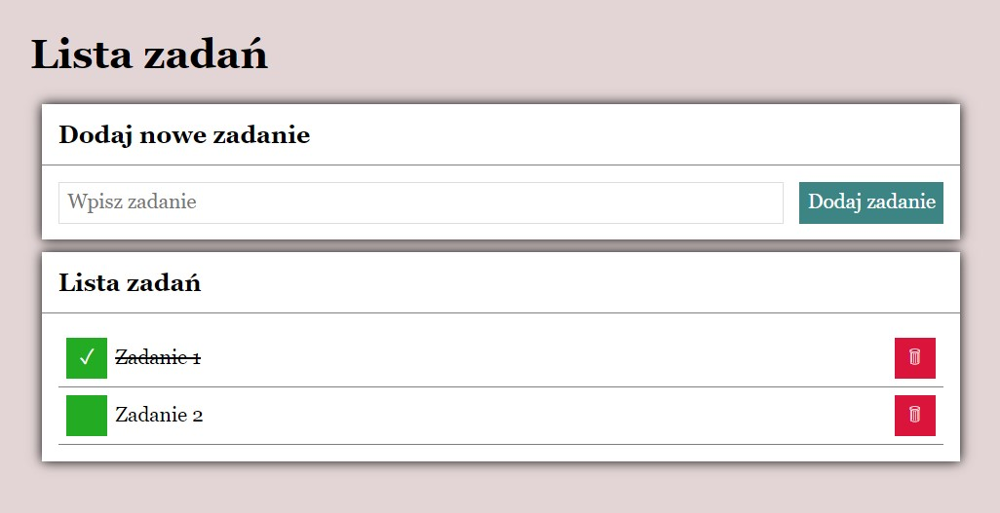

# To-do-List

It is a simple To-do List created for course training. 
In the application we can add new tasks, remove tasks and mark as done them. 
I used the following programming technologies:

-HTML 
-CSS 
-JAVA SCRIPT 
-Normalize 
-BEM convention

## Link to the To-do List

https://kristopher1001.github.io/To-do-List/
